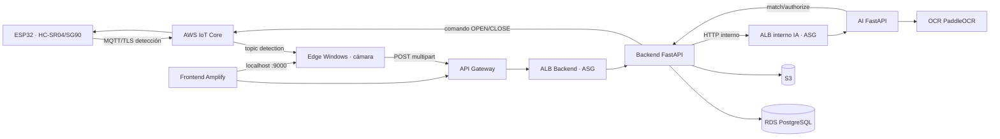

# Arquitectura SmartPark UCE

El diagrama refleja la arquitectura informada, no una comprobación de recursos AWS en esta fase. ECR almacena las imágenes Backend/AI/OCR y no aparece en la ruta de una solicitud. En local, Compose conecta DB/Backend/AI/OCR por DNS interno; Edge y firmware requieren entorno/certificados propios. Detalle verificable de red y CORS: [auditoría](../audit/12_CORS_Y_RED.md).

